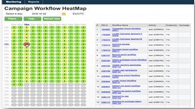
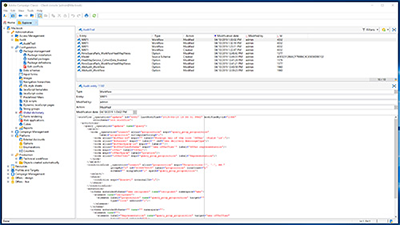
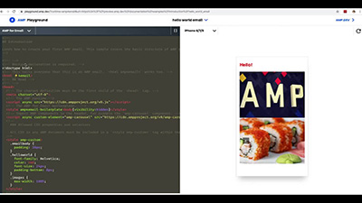

# Adobe Campaign Classic V7-tutorials - Overzicht

Adobe Campaign biedt een platform voor het ontwerpen van cross-channel klantervaringen en levert een omgeving voor visuele orkestratie van campagnes, realtime-interactiebeheer en uitvoering via meerdere kanalen. Dit handboek bevat video’s en tutorials over de vele functies en mogelijkheden van Adobe Campaign Classic V7.

>[!INFO]
> Hebt u vragen? Wilt u uw ervaring delen of gedachten uitwisselen met uw collega&#39;s? Of hebt u feedback over de leercontent voor het Adobe-team? Neem deel aan het gesprek in de [Adobe Campaign Learning Community-discussie](https://experienceleaguecommunities.adobe.com:443/t5/adobe-campaign-classic/join-the-discussion-on-adobe-campaign-learning/td-p/419096)!

## Nieuwe functies

* **[Regelpaneel voor hybride hostingmodellen](https://experienceleague.adobe.com/docs/control-panel-learn/control-panel/control-panel-for-hybrid-hosting-models.html)**

   *Leer hoe u het Configuratiescherm inschakelt voor hybride hostmodellen van Adobe Campaign, toegang krijgt tot het Configuratiescherm en sleutelfuncties ontgrendelt.*

* **[Configuratiescherm - Workflows controleren](https://experienceleague.adobe.com/docs/control-panel-learn/control-panel/performance-monitoring/monitor-workflows.html){target=&quot;_blank&quot;}**

   *Leer hoe u het tijdelijke opslaggebruik van uw workflows kunt controleren en waar u workflowinstellingen kunt configureren om database- of workflowproblemen voor uw exemplaar te voorkomen.*

* **[Configuratiescherm - Doorvoersnelheid en latentie bewaken](https://experienceleague.adobe.com/docs/control-panel-learn/control-panel/performance-monitoring/monitor-throughputs-and-latency.html){target=&quot;_blank&quot;}**

   *Leer hoe te om leveringsproductie en transactionele berichtlatentie van uw campagneinstantie te controleren.*

* **[Inleiding tot sms](https://experienceleague.adobe.com/docs/campaign-learn/set-up-sms-for-adobe-campaign/introduction-to-sms.html?lang=nl)**

   *Meer informatie over hoe sms werkt en hoe Adobe Campaign een sms verzendt*

* **[Een sms-account instellen voor een standaard SMPP-provider](https://experienceleague.adobe.com/docs/campaign-learn/set-up-sms-for-adobe-campaign/set-up-account-for-standard-smpp-provider.html?lang=nl)**

   *Leer hoe u de sms-connector aanpast aan uw SMPP-provider. Pas uw sms-instellingen aan om verbindingsgrenzen af te handelen, stel de maximale doorvoer, het verzendende venster en codering in met TLS.*

## Personeelsselectie

<table>
<tr>
  <td>
    
    

      <a href="./monitoring-campaign-classic/workflow-heatmap.md">
    <strong>Workflow-heatmaps</strong>
    </a>
    

    

    <em>Bekijk een overzicht van het aantal gelijktijdige workflows.</em>
    

  </td>
   <td>
    
    

      <a href="./monitoring-campaign-classic/audit-trail.md">
    <strong>Audittrail</strong>
    </a>
    
 
    

    <em>Leg een uitgebreide lijst met acties en gebeurtenissen in Adobe Campaign vast.</em>
    

  </td>
  <td>
    
    

      <a href="./sending-messages/email-channel/defining-interactive-email-content-with-amp.md">
    <strong>Interactieve e-mailcontent definiëren met AMP</strong>
    </a>
    

    

    <em>Informatie over het activeren en gebruiken van AMP in Adobe Campaign Classic </em>
    

  </td>
</tr>
</table>

## Aanvullende bronnen

* [Documentatie](https://experienceleague.adobe.com/docs/campaign-classic/using/getting-started/starting-with-adobe-campaign/about-adobe-campaign-classic.html?lang=nl)
